## hibernate教程

[视频地址](https://www.bilibili.com/video/av51998607?from=search&seid=11960711692608755417)

[github示例代码](https://github.com/liutaob/hibernate)

ORM 

​	业务	映射				数据库

​	域模型---ORMAPI/ORM实现---关系数据模型

### 1.与mybatis对比

[hibernate和mybatis的细致对比（开发速度、工作量、sql优化、对象管理、缓存、学习门槛）](https://www.cnblogs.com/inspurhaitian/p/4647485.html)

* Hibernate:<br>

  非常优秀、成熟的 ORM 框架。完成对象的持久化操作Hibernate 允许开发者采用面向对象的方式来操作关系数据库。消除那些针对特定数据库厂商的 SQL 代码

* myBatis：<br>

  相比 Hibernate 灵活高，运行速度快开发速度慢，不支持纯粹的面向对象操作，需熟悉sql语  句，并且熟练使用sql语句优化功能

### 2.开发步骤

>          1.创建 Hibernate 配置文件hibernate.cfg.xml		数据源、hbm2ddl.auto、showsql等
>
>          2. 创建持久化类	非final、不继承不实现、无参、set/get、（eq\hashcode）
>          3. 创建对象-关系映射文件 .hbm.xml
>          4. 通过 Hibernate API 编写访问数据库的代码

### 3.API操作步骤

~~~java
//1. 创建一个 SessionFactory 对象
		SessionFactory sessionFactory = null;
		//1). 创建 Configuration 对象: 对应 hibernate 的基本配置信息和 对象关系映射信息
		Configuration configuration = new Configuration().configure();//默认src下找hibernate.cfg.xml
		//4.0 之前这样创建
//		sessionFactory = configuration.buildSessionFactory();
		//2). 创建一个 ServiceRegistry 对象: hibernate 4.x 新添加的对象
		//hibernate 的任何配置和服务都需要在该对象中注册后才能有效.
		ServiceRegistry serviceRegistry = 
				new ServiceRegistryBuilder().applySettings(configuration.getProperties())
				                            .buildServiceRegistry();
		//3).
		sessionFactory = configuration.buildSessionFactory(serviceRegistry);
		//2. 创建一个 Session 对象 相当于jdbc的conn
		Session session = sessionFactory.openSession();
		//3. 开启事务
		Transaction transaction = session.beginTransaction();
		//4. 执行保存操作
		News news = new News("Java12345", "ATGUIGU", new Date(new java.util.Date().getTime()));
		session.save(news);//delete,update等方法
		//5. 提交事务 
		transaction.commit();
		//6. 关闭 Session
		session.close();
		//7. 关闭 SessionFactory 对象
		sessionFactory.close();
~~~

### 4.Session操作

##### 4.1 对象状态 

Session 的特定方法能使对象从一个状态转换到另一个状态，站在持久化的角度, Hibernate 把对象分为 **4 种状态**: 

* 持久化状态：有主键，建立了上下文环境即在seesion缓存中

* 临时状态：new 无ID

* 游离状态,：new 有ID

* 删除状态. 有主键，建立了上下文环境，但数据库删除

  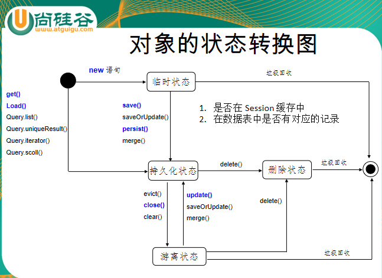

##### 4.2 主键策略

（generator class="native"自动选择、increment自增、identity 只mysql等、sequence 只oracle等） 主键推荐整数long、short、int，比字符串更节省数据库空间

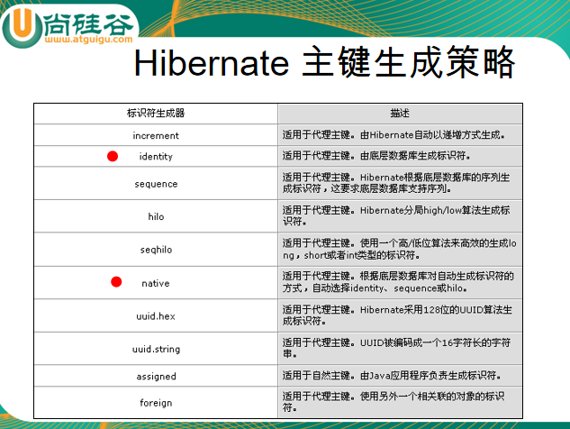

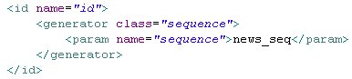

##### 4.3 事务的级别

（对比数据库oracle、mysql、spring、hibernate中显示设置）

1. READ UNCOMMITED
2. READ COMMITED          解决脏读
3. REPEATABLE READ        脏读、不可重复读
4. SERIALIZEABLE              全部

##### 4.4 基本方法

1）persist() 和 save() 区别：当对一个 OID 不为 Null 的对象执行 save() 方法时, 会把该对象以一个新的 oid 保存到数据库中相当于白设置id;  但执行 persist() 方法时会抛出一个异常即必须无id同JPA.（**JPA的persist必须无ID**）

2）get()和load()区别：数据库不存在load报错，延迟加载策略	get返回null	都是根据OID获取持久化对象 对比JPA的find/findRef

3）update()：游离对象转持久化，数据库无报错 ；映射class属性  select-before-update修改了才执行sql

持久化对象无需显示调用，直接get修改即可，最后提交事务会flush；游离对象需要显示调用

4）saveOrUpdate():OID为null则save，非null则update ，id属性 unsaved-value 

5）merge()方法类比JPA

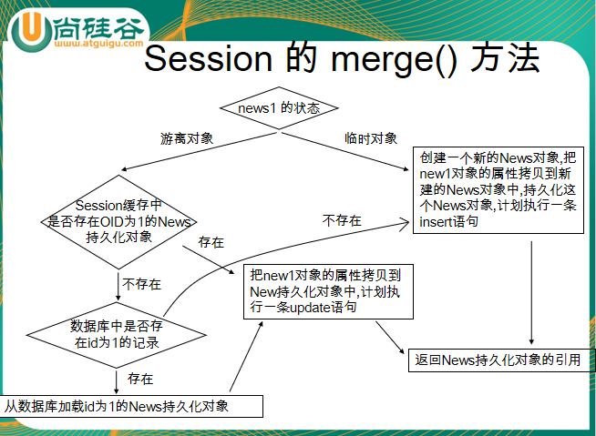

6)delete()即可删除游离，也可持久化对象，类比JPA只能持久化

```
Session缓存：减少数据库频率，flush，commit
clear(): 清理缓存
refresh(): 会强制发送 SELECT 语句, 以使 Session 缓存中对象的状态和数据表中对应的记录保持一致!
```

##### **4.5 高级方法**

1. QBC:  简单查询、分页、分组函数排序等等参考代码

   *createCriteria(XX.class).list()条件查 list uniqueResult单条等

   *//1. 创建一个 Criteria 对象Criteria criteria = session.createCriteria(Employee.class);

   //2. 添加查询条件: 在 QBC 中查询条件使用 Criterion 来表示//Criterion 可以通过 Restrictions 的静态方法得到criteria.add(Restrictions.eq("email", "SKUMAR"));criteria.add(Restrictions.gt("salary", 5000F));

   //3. 执行查询Employee employee = (Employee) criteria.uniqueResult();System.out.println(employee); 

2. HQL:     参考sql和JPA

   *createQuery  session.createQuery("FROM Student").list()

   *设置参数   :属性 或？

   session.createQuery("FROM Person WHERE ID=?").setParameter(0,1).list();
   session.createQuery("FROM Person WHERE ID=?").setParameter(0,1).uniqueResult();

   *String hql = "UPDATE Person p SET p.age = 20";
   session.createQuery(hql).executeUpdate();

   *session.getNamedQuery 结合nbm文件中query

   *分页查询setFirstResult、setMaxResults

   *两种字段查询

   *分组、嵌套、多表 

3. SQL:     

   session.createSQLQuery() 本地sql

   ```
   String sql = "INSERT INTO gg_department VALUES(?, ?)";
   Query query = session.createSQLQuery(sql);
   query.setInteger(0, 280)
        .setString(1, "ATGUIGU")
        .executeUpdate();
   ```


### 5.调用存储过程、触发器

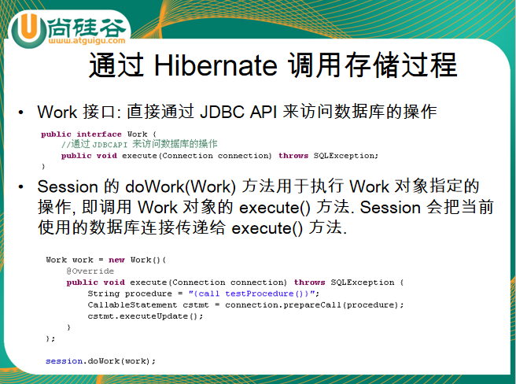

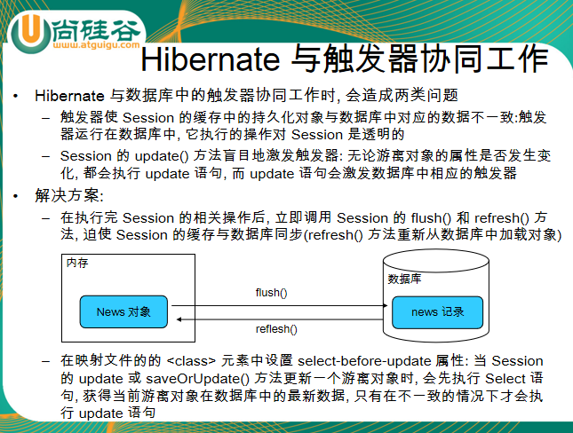

### 6.配置文件

**hibernate.cfg.xml或hibernate.properties常用属性**

~~~
connection.url：数据库URL 
connection.username：数据库用户名
connection.password：数据库用户密码 
connection.driver_class：数据库JDBC驱动
dialect：配置数据库的方言，根据底层的数据库不同产生不同的 sql 语句，Hibernate 会针对数据库的特性在访问时进行优化
show_sql：是否将运行期生成的SQL输出到日志以供调试。取值 true | false 
format_sql：是否将 SQL 转化为格式良好的 SQL . 取值 true | false
hbm2ddl.auto：在启动和停止时自动地创建，更新或删除数据库模式。取值 create|update|create-drop|validate
hibernate.jdbc.fetch_size  	读取条数
hibernate.jdbc.batch_size	增删改条数
~~~

~~~xml
<?xml version="1.0" encoding="UTF-8"?>
<!DOCTYPE hibernate-configuration PUBLIC
		"-//Hibernate/Hibernate Configuration DTD 3.0//EN"
		"http://hibernate.sourceforge.net/hibernate-configuration-3.0.dtd">
<hibernate-configuration>
	<session-factory>
		<!-- 配置连接数据库的基本信息 -->
		<property name="connection.username">root</property>
		<property name="connection.password">123456</property>
		<property name="connection.driver_class">com.mysql.jdbc.Driver</property>
		<property name="connection.url">jdbc:mysql://127.0.0.1:3306/hibernate5</property>
		<!-- 配置 hibernate 的基本信息 -->
		<!-- hibernate 所使用的数据库方言 -->
		<property name="dialect">org.hibernate.dialect.MySQLInnoDBDialect</property>		
		<!-- 执行操作时是否在控制台打印 SQL -->
		<property name="show_sql">true</property>
		<!-- 是否对 SQL 进行格式化 -->
		<property name="format_sql">true</property>
		<!-- 指定自动生成数据表的策略 -->
		<property name="hbm2ddl.auto">update</property>
		<!-- 指定关联的 .hbm.xml 文件 -->
		<mapping resource="com/atguigu/hibernate/helloworld/News.hbm.xml"/>
	</session-factory>
</hibernate-configuration>
~~~

**对象关系映射文件*.hbm.xml**

可以对应多个类，但推荐一个类一个文件

~~~
类层次：class
主键：id
基本类型:property
实体引用类: many-to-one  |  one-to-one
集合:set | list | map | array
one-to-many
many-to-many
子类:subclass | joined-subclass
其它:component | any 等
查询语句:query（用来放置查询语句，便于对数据库查询的统一管理和优化）
每个Hibernate-mapping中可以同时定义多个类. 但更推荐为每个类都创建一个单独的映射文件
--------------------------------------------------------------------------------------
hibernate-mapping
hibernate-mapping 是 hibernate 映射文件的根元素
schema: 指定所映射的数据库schema的名称。若指定该属性, 则表明会自动添加该 schema 前缀
catalog:指定所映射的数据库catalog的名称。  
default-cascade(默认为 none): 设置hibernate默认的级联风格. 若配置 Java 属性, 集合映射时没有指定 cascade 属性, 则 Hibernate 将采用此处指定的级联风格.   
default-access (默认为 property): 指定 Hibernate 的默认的属性访问策略。默认值为 property, 即使用 getter, setter 方法来访问属性. 若指定 access, 则 Hibernate 会忽略 getter/setter 方法, 而通过反射访问成员变量.
default-lazy(默认为 true): 设置 Hibernat morning的延迟加载策略. 该属性的默认值为 true, 即启用延迟加载策略. 若配置 Java 属性映射, 集合映射时没有指定 lazy 属性, 则 Hibernate 将采用此处指定的延迟加载策略 
auto-import (默认为 true): 指定是否可以在查询语言中使用非全限定的类名（仅限于本映射文件中的类）。 
package (可选): 指定一个包前缀，如果在映射文档中没有指定全限定的类名， 就使用这个作为包名。
-------------------------------------------------------------------------------------
class 元素用于指定类和表的映射
name:指定该持久化类映射的持久化类的类名
table:指定该持久化类映射的表名, Hibernate 默认以持久化类的类名作为表名
dynamic-insert: 若设置为 true, 表示当保存一个对象时, 会动态生成 insert 语句, insert 语句中仅包含所有取值不为 null 的字段. 默认值为 false
dynamic-update: 若设置为 true, 表示当更新一个对象时, 会动态生成 update 语句, update 语句中仅包含所有取值需要更新的字段. 默认值为 false
select-before-update:设置 Hibernate 在更新某个持久化对象之前是否需要先执行一次查询. 默认值为 false
batch-size:指定根据 OID 来抓取实例时每批抓取的实例数.
lazy: 指定是否使用延迟加载.  
mutable: 若设置为 true, 等价于所有的 <property> 元素的 update 属性为 false, 表示整个实例不能被更新. 默认为 true. 
discriminator-value: 指定区分不同子类的值. 当使用 <subclass/> 元素来定义持久化类的继承关系时需要使用该属性
----------------------------------------------------------------------------------------
id：设定持久化类的 OID 和表的主键的映射
name: 标识持久化类 OID 的属性名  
column: 设置标识属性所映射的数据表的列名(主键字段的名字). 
unsaved-value:若设定了该属性, Hibernate 会通过比较持久化类的 OID 值和该属性值来区分当前持久化类的对象是否为临时对象
type:指定 Hibernate 映射类型. Hibernate 映射类型是 Java 类型与 SQL 类型的桥梁. 如果没有为某个属性显式设定映射类型, Hibernate 会运用反射机制先识别出持久化类的特定属性的 Java 类型, 然后自动使用与之对应的默认的 Hibernate 映射类型
Java 的基本数据类型和包装类型对应相同的 Hibernate 映射类型. 基本数据类型无法表达 null, 所以对于持久化类的 OID 推荐使用包装类型
------------------------------------------------------------------------------------------
property 元素用于指定类的属性和表的字段的映射
name:指定该持久化类的属性的名字
column:指定与类的属性映射的表的字段名. 如果没有设置该属性, Hibernate 将直接使用类的属性名作为字段名. 
type:指定 Hibernate 映射类型. Hibernate 映射类型是 Java 类型与 SQL 类型的桥梁. 如果没有为某个属性显式设定映射类型, Hibernate 会运用反射机制先识别出持久化类的特定属性的 Java 类型, 然后自动使用与之对应的默认的 Hibernate 映射类型.
not-null:若该属性值为 true, 表明不允许为 null, 默认为 false
access:指定 Hibernate 的默认的属性访问策略。默认值为 property, 即使用 getter, setter 方法来访问属性. 若指定 field, 则 Hibernate 会忽略 getter/setter 方法, 而通过反射访问成员变量
unique: 设置是否为该属性所映射的数据列添加唯一约束. 
property 元素用于指定类的属性和表的字段的映射
index: 指定一个字符串的索引名称. 当系统需要 Hibernate 自动建表时, 用于为该属性所映射的数据列创建索引, 从而加快该数据列的查询.
length: 指定该属性所映射数据列的字段的长度
scale: 指定该属性所映射数据列的小数位数, 对 double, float, decimal 等类型的数据列有效.
formula：设置一个 SQL 表达式, Hibernate 将根据它来计算出派生属性的值. 
派生属性: 并不是持久化类的所有属性都直接和表的字段匹配, 持久化类的有些属性的值必须在运行时通过计算才能得出来, 这种属性称为派生属性
使用 formula 属性时
formula=“(sql)” 的英文括号不能少
Sql 表达式中的列名和表名都应该和数据库对应, 而不是和持久化对象的属性对应
如果需要在 formula 属性中使用参数, 这直接使用 where cur.id=id 形式, 其中 id 就是参数, 和当前持久化对象的 id 属性对应的列的 id 值将作为参数传入. 
~~~

~~~xml
<?xml version="1.0"?>
<!DOCTYPE hibernate-mapping PUBLIC "-//Hibernate/Hibernate Mapping DTD 3.0//EN"
"http://hibernate.sourceforge.net/hibernate-mapping-3.0.dtd">
<hibernate-mapping package="com.atguigu.hibernate.helloworld">
    <class name="News" table="NEWS" dynamic-insert="true" select-before-update="true">
        <id name="id" type="java.lang.Integer">
            <column name="ID" />
            <!-- 指定主键的生成方式, native: 使用数据库本地方式 -->
            <generator class="native" />
        </id>
        <property name="title" not-null="true" unique="true"
        	index="news_index" length="50"
        	type="java.lang.String" column="TITLE" >
        </property>
        <property name="author" type="java.lang.String"
        	index="news_index">
            <column name="AUTHOR" />
        </property>
      <!-- 必须显示指定-->
        <property name="date" type="date">
            <column name="DATE" />
        </property>
      <!-- 生成规则-->
        <property name="desc" 
        	formula="(SELECT concat(title, ',', author) FROM NEWS n WHERE n.id = id)"></property>
		<property name="content">
			<column name="CONTENT" sql-type="text"></column>
		</property>
		<property name="picture" column="PICTURE" type="blob"></property>
    </class> 
</hibernate-mapping>
~~~


### 7.映射关系 11 1n nn 双向单向  HQL 缓存

#### 7.1基本类型

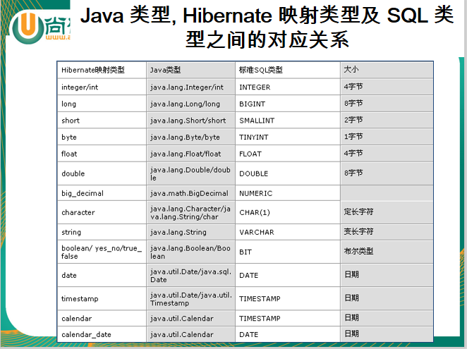

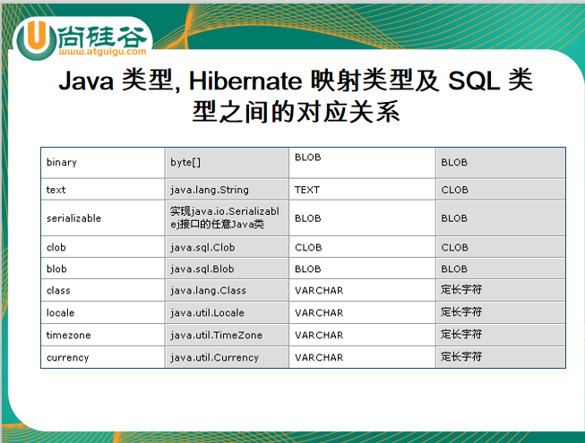

#### 7.2日期类型

~~~
以下情况下必须显式指定 Hibernate 映射类型一个 Java 类型可能对应多个 Hibernate 映射类型. 例如: 如果持久化类的属性为 java.util.Date 类型, 对应的 Hibernate 映射类型可以是 date, time 或 timestamp. 此时必须根据对应的数据表的字段的 SQL 类型, 来确定 Hibernate 映射类型. 如果字段为 DATE 类型, 那么 Hibernate 映射类型为 date; 如果字段为 TIME 类型, 那么 Hibernate 映射类型为 time; 如果字段为 TIMESTATMP 类型, 那么 Hibernate 映射类型为 timestamp.
~~~

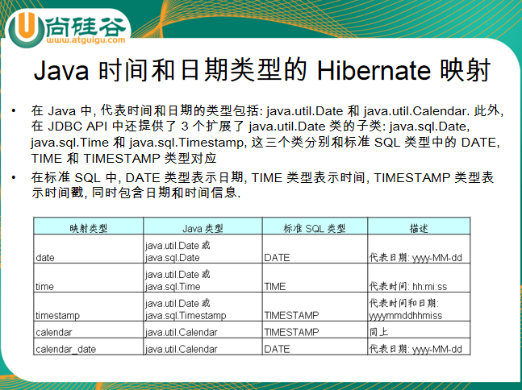

#### 7.3大字段类型

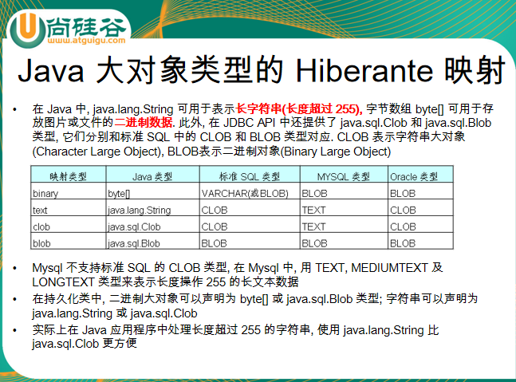

#### 7.4映射组成关系

> 域模型: 由程序代码组成, 通过细化持久化类的的粒度可提高代码的可重用性, 简化编程

> 在没有数据冗余的情况下, 应该尽可能减少表的数目, 简化表之间的参照关系, 以便提高数据的访问速度

#### 7.5 复杂类型

woker-pay双向为例 聚合，并非两张表，只有一个wokernbm

~~~
 <!-- 映射组成关系 -->
        <component name="pay" class="Pay">
        	<parent name="worker"/>
        	<!-- 指定组成关系的组件的属性 -->
        	<property name="monthlyPay" column="MONTHLY_PAY"></property>
        	<property name="yearPay" column="YEAR_PAY"></property>
        	<property name="vocationWithPay" column="VOCATION_WITH_PAY"></property>
        </component>
~~~

#### 7.6一对多一对一多对多单双向  

 **类比JPA**

##### 7.6.1 一对多 单向

**1--n			顾客--订单引用顾客	单向**

* 保存操作：先保存少的一方sql更少
* 查询操作：少的一方不级联，用到才级联，多的一方就单表

~~~java
//顾客
public class Customer {
	private Integer customerId;
	private String customerName;
	public Integer getCustomerId() {
		return customerId;
	}
	public void setCustomerId(Integer customerId) {
		this.customerId = customerId;
	}
	public String getCustomerName() {
		return customerName;
	}
	public void setCustomerName(String customerName) {
		this.customerName = customerName;
	}
}
//订单
public class Order {
	private Integer orderId;
	private String orderName;
	private Customer customer;
	public Integer getOrderId() {
		return orderId;
	}
	public void setOrderId(Integer orderId) {
		this.orderId = orderId;
	}
	public String getOrderName() {
		return orderName;
	}
	public void setOrderName(String orderName) {
		this.orderName = orderName;
	}
	public Customer getCustomer() {
		return customer;
	}
	public void setCustomer(Customer customer) {
		this.customer = customer;
	}
}
~~~


~~~xml
<!--  customer.nbm  -->
<class name="com.atguigu.hibernate.entities.n21.Customer" table="CUSTOMERS">
        <id name="customerId" type="java.lang.Integer">
            <column name="CUSTOMER_ID" />
            <generator class="native" />
        </id>
        <property name="customerName" type="java.lang.String">
            <column name="CUSTOMER_NAME" />
        </property>
    </class>
    
<!--  order.npm  -->
<class name="Order" table="ORDERS">
        <id name="orderId" type="java.lang.Integer">
            <column name="ORDER_ID" />
            <generator class="native" />
        </id>
        <property name="orderName" type="java.lang.String">
            <column name="ORDER_NAME" />
        </property>  
		<!-- 
			映射多对一的关联关系。 使用 many-to-one 来映射多对一的关联关系 
			name: 多这一端关联的一那一端的属性的名字
			class: 一那一端的属性对应的类名
			column: 一那一端在多的一端对应的数据表中的外键的名字
		-->
		<many-to-one name="customer" class="Customer" column="CUSTOMER_ID"></many-to-one>
    </class>
~~~

##### 7.6.2 一对多 双向

**1--n			顾客引用订单集合--订单引用顾客	双向**

多的一方manytoone 	少的一方set/list中onetomany

* 保存操作：先保存少的一端，再保存多的一端	注意通过inverse=true指定哪方维持关系即另一方外键 否则双方外键，多出update语句
* 查询操作：少的一方默认懒加载，用到才查多条  可在set标签上指定懒加载false，则没用到多的也查多条
* 更新操作：查两个再更
* 删除操作：不能删除被引用的 cascade属性指定级联删除 默认none  改delete级联删除 delete方法才行 

~~~java
//顾客
public class Customer {
	private Integer customerId;
	private String customerName;
	/*
	 * 1. 声明集合类型时, 需使用接口类型, 因为 hibernate 在获取
	 * 集合类型时, 返回的是 Hibernate 内置的集合类型, 而不是 JavaSE 一个标准的
	 * 集合实现. 
	 * 2. 需要把集合进行初始化, 可以防止发生空指针异常
	 */
	private Set<Order> orders = new HashSet<>();
	public Integer getCustomerId() {
		return customerId;
	}
	public void setCustomerId(Integer customerId) {
		this.customerId = customerId;
	}
	public String getCustomerName() {
		return customerName;
	}
	public void setCustomerName(String customerName) {
		this.customerName = customerName;
	}
	public Set<Order> getOrders() {
		return orders;
	}
	public void setOrders(Set<Order> orders) {
		this.orders = orders;
	}
}
//订单
public class Order {
	private Integer orderId;
	private String orderName;
	private Customer customer;
	public Integer getOrderId() {
		return orderId;
	}
	public void setOrderId(Integer orderId) {
		this.orderId = orderId;
	}
	public String getOrderName() {
		return orderName;
	}
	public void setOrderName(String orderName) {
		this.orderName = orderName;
	}
	public Customer getCustomer() {
		return customer;
	}
	public void setCustomer(Customer customer) {
		this.customer = customer;
	}
}
~~~

~~~xml
<!--顾客 -->
 <class name="Customer" table="CUSTOMERS">
    
        <id name="customerId" type="java.lang.Integer">
            <column name="CUSTOMER_ID" />
            <generator class="native" />
        </id>
    
        <property name="customerName" type="java.lang.String">
            <column name="CUSTOMER_NAME" />
        </property>
        
        <!-- 映射 1 对多的那个集合属性 -->
        <!-- set: 映射 set 类型的属性, table: set 中的元素对应的记录放在哪一个数据表中. 该值需要和多对一的多的那个表的名字一致 -->
        <!-- inverse: 指定由哪一方来维护关联关系. 通常设置为 true, 以指定由多的一端来维护关联关系 -->
        <!-- cascade 设定级联操作. 开发时不建议设定该属性. 建议使用手工的方式来处理 -->
        <!-- order-by 在查询时对集合中的元素进行排序, order-by 中使用的是表的字段名, 而不是持久化类的属性名  -->
        <set name="orders" table="ORDERS" inverse="true" order-by="ORDER_NAME DESC">
        	<!-- 执行多的表中的外键列的名字 -->
        	<key column="CUSTOMER_ID"></key>
        	<!-- 指定映射类型 -->
        	<one-to-many class="Order"/>
        </set>
        
    </class>
<!--订单 -->
<class name="Order" table="ORDERS">

        <id name="orderId" type="java.lang.Integer">
            <column name="ORDER_ID" />
            <generator class="native" />
        </id>
        
        <property name="orderName" type="java.lang.String">
            <column name="ORDER_NAME" />
        </property>
        
		<!-- 
			映射多对一的关联关系。 使用 many-to-one 来映射多对一的关联关系 
			name: 多这一端关联的一那一端的属性的名字
			class: 一那一端的属性对应的类名
			column: 一那一端在多的一端对应的数据表中的外键的名字
		-->
		<many-to-one name="customer" class="Customer" column="CUSTOMER_ID"></many-to-one>

    </class>
~~~

##### 7.6.3一对一双向---基于外键映射 

**1--1		部门---经理互相引用 但只指定部门表内建外键**

```
部门 many-to-one	unique=“true” 属性来表示为1-1关联
经理one-to-one	property-ref="mgr"可省略

拓展1：若部门改成onetoone无外键生成，部门查经理报错，经理查部门左外

拓展2：两边都是manytoone则两端都外键无法删除
```

- 保存操作：先保存没外键的经理 2insert 先保存有外键的部门则有update
- 查询操作：部门查经理懒加载（内含左外3条查询），经理查部门，左外连接，  可在对应标签中设置策略

~~~java
//部门
public class Department {
	private Integer deptId;
	private String deptName;
	private Manager mgr;
	public Integer getDeptId() {
		return deptId;
	}
	public void setDeptId(Integer deptId) {
		this.deptId = deptId;
	}
	public String getDeptName() {
		return deptName;
	}
	public void setDeptName(String deptName) {
		this.deptName = deptName;
	}
	public Manager getMgr() {
		return mgr;
	}
	public void setMgr(Manager mgr) {
		this.mgr = mgr;
	}
}
//经理
public class Manager {
	private Integer mgrId;
	private String mgrName;
	private Department dept;
	public Integer getMgrId() {
		return mgrId;
	}
	public void setMgrId(Integer mgrId) {
		this.mgrId = mgrId;
	}
	public String getMgrName() {
		return mgrName;
	}
	public void setMgrName(String mgrName) {
		this.mgrName = mgrName;
	}
	public Department getDept() {
		return dept;
	}
	public void setDept(Department dept) {
		this.dept = dept;
	}
}
~~~

~~~xml
<!--部门 -->
<class name="com.atguigu.hibernate.one2one.foreign.Department" table="DEPARTMENTS">

        <id name="deptId" type="java.lang.Integer">
            <column name="DEPT_ID" />
            <generator class="native" />
        </id>
        
        <property name="deptName" type="java.lang.String">
            <column name="DEPT_NAME" />
        </property>
		
		<!-- 使用 many-to-one 的方式来映射 1-1 关联关系 -->
		<many-to-one name="mgr" class="com.atguigu.hibernate.one2one.foreign.Manager" 
			column="MGR_ID" unique="true"></many-to-one>	              
    </class>
<!--经理 -->
<class name="com.atguigu.hibernate.one2one.foreign.Manager" table="MANAGERS">
        <id name="mgrId" type="java.lang.Integer">
            <column name="MGR_ID" />
            <generator class="native" />
        </id>
        <property name="mgrName" type="java.lang.String">
            <column name="MGR_NAME" />
        </property>
        <!-- 映射 1-1 的关联关系: 在对应的数据表中已经有外键了, 当前持久化类使用 one-to-one 进行映射 -->
        <!-- 
        	没有外键的一端需要使用one-to-one元素，该元素使用 property-ref 属性指定使用被关联实体主键以外的字段作为关联字段
         -->
        <one-to-one name="dept" 
        	class="com.atguigu.hibernate.one2one.foreign.Department"
        	property-ref="mgr"></one-to-one>
    </class>
~~~

##### 7.6.4一对一单向---基于外键映射

**1--1		部门引用经理---经理 但只指定部门表内建外键**

~~~
java参考上
1）表有外键关系
   部门manytoone  unique=“true” 属性来表示为1-1关联
   经理npm中无对应
- 保存操作同上
- 查询操作：部门查经理懒加载2条单查   经理查部门单

2）表无外键关系
部门中onetoone 无ref
经理npm无对应
- 保存操作 即单表插入
- 查询操作：部门查经理左外	经理查部门单

~~~

##### 7.6.5一对一双向---基于主键映射

两边都是onetoone 部门的主键由引用经理的外键生成 	constrained=true  生成的表都是两个字段

* 保存操作：先保存哪边都没有多余的update
* 查询操作：部门查经理 懒加载（3条查询含左外）  经理查部门左外连接   也可在标签指定

~~~java
//同上
~~~

~~~xml
<!-- 部门-->
<class name="Department" table="DEPARTMENTS">
        <id name="deptId" type="java.lang.Integer">
            <column name="DEPT_ID" />
            <!-- 使用外键的方式来生成当前的主键 -->
            <generator class="foreign">
            	<!-- property 属性指定使用当前持久化类的哪一个属性的主键作为外键 -->
            	<param name="property">mgr</param>
            </generator>
        </id>
        <property name="deptName" type="java.lang.String">
            <column name="DEPT_NAME" />
        </property>
		<!--
		采用 foreign 主键生成器策略的一端增加 one-to-one 元素映射关联属性,
		其 one-to-one 节点还应增加 constrained=true 属性, 以使当前的主键上添加外键约束
		-->
		<one-to-one name="mgr" class="Manager" constrained="true"></one-to-one>
    </class>
<!-- 经理-->
 <class name="com.atguigu.hibernate.one2one.primary.Manager" table="MANAGERS">
        <id name="mgrId" type="java.lang.Integer">
            <column name="MGR_ID" />
            <generator class="native" />
        </id>
        <property name="mgrName" type="java.lang.String">
            <column name="MGR_NAME" />
        </property>
        <one-to-one name="dept" 
        	class="com.atguigu.hibernate.one2one.primary.Department"></one-to-one>
    </class>
~~~

##### 7.6.5多对多单向

商品类目为例，参考一对多的单向和多对多的双向	双向必须指定一端维护关系 单向不需  类比JPA的mappedby

* 操作同下

##### 7.6.6多对多双向

**商品---类目 互相引用**

两边都是set标签 manytomany  中间表  	inverse="true"必须指定一端商品维护关系 中间表引用两个外键

* 保存操作：各2条X2 +4条桥表
* 查询操作：默认懒加载 1单1左外

~~~java
//商品
public class Item {
	private Integer id;
	private String name;
	private Set<Category> categories = new HashSet<>();
	public Integer getId() {
		return id;
	}
	public void setId(Integer id) {
		this.id = id;
	}
	public String getName() {
		return name;
	}
	public void setName(String name) {
		this.name = name;
	}
	public Set<Category> getCategories() {
		return categories;
	}
	public void setCategories(Set<Category> categories) {
		this.categories = categories;
	}
}
//类目
public class Category {
	private Integer id;
	private String name;
	private Set<Item> items = new HashSet<>();
	public Integer getId() {
		return id;
	}
	public void setId(Integer id) {
		this.id = id;
	}
	public String getName() {
		return name;
	}
	public void setName(String name) {
		this.name = name;
	}
	public Set<Item> getItems() {
		return items;
	}
	public void setItems(Set<Item> items) {
		this.items = items;
	}
}
~~~

~~~xml
<!-- 商品-->
<class name="com.atguigu.hibernate.n2n.Item" table="ITEMS">
        
        <id name="id" type="java.lang.Integer">
            <column name="ID" />
            <generator class="native" />
        </id>
        
        <property name="name" type="java.lang.String">
            <column name="NAME" />
        </property>
        
        <set name="categories" table="CATEGORIES_ITEMS" inverse="true">
        	<key column="I_ID"></key>
        	<many-to-many class="com.atguigu.hibernate.n2n.Category" column="C_ID"></many-to-many>
        </set>
        
    </class> 
<!-- 类目-->
<class name="Category" table="CATEGORIES">
        <id name="id" type="java.lang.Integer">
            <column name="ID" />
            <generator class="native" />
        </id>
        <property name="name" type="java.lang.String">
            <column name="NAME" />
        </property>
        <!-- table: 指定中间表 -->
        <set name="items" table="CATEGORIES_ITEMS">
            <key>
                <column name="C_ID" />
            </key>
            <!-- 使用 many-to-many 指定多对多的关联关系. column 执行 Set 集合中的持久化类在中间表的外键列的名称  -->
            <many-to-many class="Item" column="I_ID"></many-to-many>
        </set>
    </class>

~~~

#### 8.映射继承关系

##### 8.1 subclass继承

person student为例

父子类字段在一个表，有辨别列，没有的字段就为空，所以子类字段不能非空约束；

缺点：继承层次深，表字段就多；

~~~
采用 subclass 的继承映射可以实现对于继承关系中父类和子类使用同一张表
因为父类和子类的实例全部保存在同一个表中，因此需要在该表内增加一列，使用该列来区分每行记录到低是哪个类的实例----这个列被称为辨别者列(discriminator).
在这种映射策略下，使用 subclass 来映射子类，使用 class 或 subclass 的 discriminator-value 属性指定辨别者列的值
所有子类定义的字段都不能有非空约束。如果为那些字段添加非空约束，那么父类的实例在那些列其实并没有值，这将引起数据库完整性冲突，导致父类的实例无法保存到数据库中
~~~

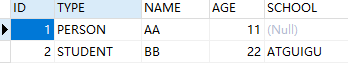

* 插入操作 辨别列维护

* 查询操作 都是单表session.createQuery("FROM Student").list()  session.createCriteria(Person.class).list();

* ```java
  //参数占位从0开始
  session.createQuery("FROM Person WHERE ID=?").setParameter(0,1).list();
  session.createQuery("FROM Person WHERE ID=?").setParameter(0,1).uniqueResult();
  ```

~~~java
//人
public class Person {
	private Integer id;
	private String name;
	private int age;
	public Integer getId() {
		return id;
	}
	public void setId(Integer id) {
		this.id = id;
	}
	public String getName() {
		return name;
	}
	public void setName(String name) {
		this.name = name;
	}
	public int getAge() {
		return age;
	}
	public void setAge(int age) {
		this.age = age;
	}
}
//学生
public class Student extends Person{
	private String school;
	public String getSchool() {
		return school;
	}
	public void setSchool(String school) {
		this.school = school;
	}
}
~~~

~~~xml
 <!--父类标签-->
<class name="Person" table="PERSONS" discriminator-value="PERSON">

        <id name="id" type="java.lang.Integer">
            <column name="ID" />
            <generator class="native" />
        </id>
        
        <!-- 配置辨别者列 -->
		<discriminator column="TYPE" type="string"></discriminator>

        <property name="name" type="java.lang.String">
            <column name="NAME" />
        </property>
        
        <property name="age" type="int">
            <column name="AGE" />
        </property>
        
        <!-- 映射子类 Student, 使用 subclass 进行映射 -->
        <subclass name="Student" discriminator-value="STUDENT">
        	<property name="school" type="string" column="SCHOOL"></property>
        </subclass>
        
    </class>
~~~

##### 8.2 joined-subclass继承

每个子类一张表

子类通过key共享父类主键 即student中主键引用person外键

父类实例保存在父类表中，子类实例由父类表和子类表共同存储。因为子类实例也是一个特殊的父类实例；

```
优点:
* 1. 不需要使用了辨别者列.
* 2. 子类独有的字段能添加非空约束.
* 3. 没有冗余的字段
```

~~~
采用 joined-subclass 元素的继承映射可以实现每个子类一张表
采用这种映射策略时，父类实例保存在父类表中，子类实例由父类表和子类表共同存储。因为子类实例也是一个特殊的父类实例，因此必然也包含了父类实例的属性。于是将子类和父类共有的属性保存在父类表中，子类增加的属性，则保存在子类表中。
在这种映射策略下，无须使用鉴别者列，但需要为每个子类使用 key 元素映射共有主键。
子类增加的属性可以添加非空约束。因为子类的属性和父类的属性没有保存在同一个表中
~~~

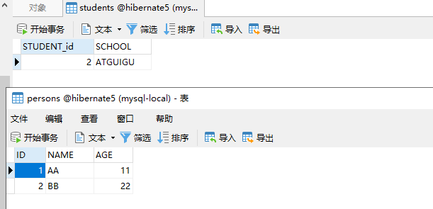

* 插入操作：参考以上介绍
* 查询操作： 1. 查询父类记录, 做一个左外连接查询 2. 对于子类记录, 做一个内连接查询. 

java代码同上

person配置

~~~xml
  <class name="Person" table="PERSONS">
        <id name="id" type="java.lang.Integer">
            <column name="ID" />
            <generator class="native" />
        </id>
        <property name="name" type="java.lang.String">
            <column name="NAME" />
        </property>
        <property name="age" type="int">
            <column name="AGE" />
        </property>
        <joined-subclass name="Student" table="STUDENTS">
        	<key column="STUDENT_id"></key>
        	<property name="school" type="string" column="SCHOOL"></property>
        </joined-subclass>
    </class>
~~~

##### 8.3 union-subclass继承

三张表 需要采用代理主键

```
/**
 * 优点:
 * 1. 无需使用辨别者列.
 * 2. 子类独有的字段能添加非空约束.
 * 
 * 缺点:
 * 1. 存在冗余的字段
 * 2. 若更新父表的字段, 则更新的效率较低
 */
```

~~~
采用 union-subclass 元素可以实现将每一个实体对象映射到一个独立的表中。
子类增加的属性可以有非空约束 --- 即父类实例的数据保存在父表中，而子类实例的数据保存在子类表中。
子类实例的数据仅保存在子类表中, 而在父类表中没有任何记录
在这种映射策略下，子类表的字段会比父类表的映射字段要多,因为子类表的字段等于父类表的字段、加子类增加属性的总和
在这种映射策略下，既不需要使用鉴别者列，也无须使用 key 元素来映射共有主键.
使用 union-subclass 映射策略是不可使用 identity 的主键生成策略, 因为同一类继承层次中所有实体类都需要使用同一个主键种子, 即多个持久化实体对应的记录的主键应该是连续的. 受此影响, 也不该使用 native 主键生成策略, 因为 native 会根据数据库来选择使用 identity 或 sequence.

~~~

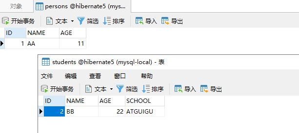

* 插入操作：各自的表
* 查询操作： 1. 查询父类记录, 需把父表和子表记录汇总到一起再做查询. 性能稍差，union连接查询. 2. 对于子类记录, 也只需要查询一张数据表
* 更新操作 ：修改父类也会改子类

```
String hql = "UPDATE Person p SET p.age = 20";
session.createQuery(hql).executeUpdate();
```

~~~java
//java同上
~~~

~~~xml
 <class name="Person" table="PERSONS">
        <id name="id" type="java.lang.Integer">
            <column name="ID" />
            <generator class="hilo" />
        </id>
        <property name="name" type="java.lang.String">
            <column name="NAME" />
        </property>
        <property name="age" type="int">
            <column name="AGE" />
        </property>
		<union-subclass name="Student" table="STUDENTS">
			<property name="school" column="SCHOOL" type="string"></property>
		</union-subclass>        
    </class>
~~~

##### 8.4 三种对比

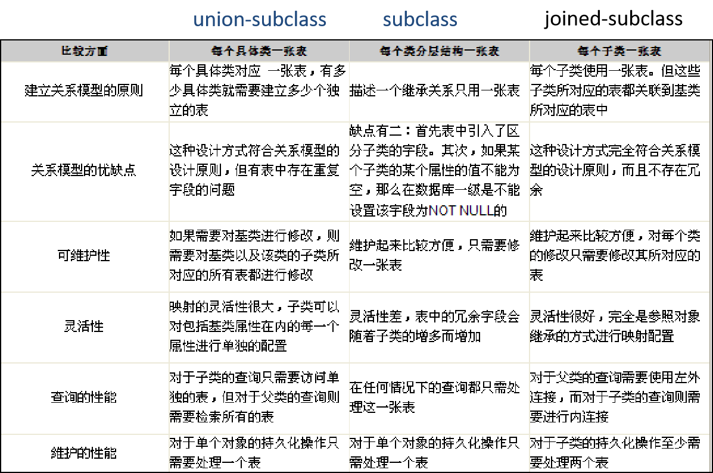

#### 9.检索策略

##### 9.1 类级别class标签lazy属性

~~~
1）无论 <class> 元素的 lazy 属性是 true 还是 false, Session 的 get() 方法及 Query 的 list() 方法在类级别总是使用立即检索策略   一调用方法就多条sql查询
2）若 <class> 元素的 lazy 属性为 true 或取默认值, Session 的 load() 方法不会执行查询数据表的 SELECT 语句, 仅返回代理类对象的实例,			用到才查，flase会立即检索
该代理类实例有如下特征:
由 Hibernate 在运行时采用 CGLIB 工具动态生成
Hibernate 创建代理类实例时, 仅初始化其 OID 属性
在应用程序第一次访问代理类实例的非 OID 属性时, Hibernate 会初始化代理类实例

~~~

##### 9.2 一对多、多对多set标签lazy属性

true 用到才查

flase立即检索

~~~
在映射文件中, 用 <set> 元素来配置一对多关联及多对多关联关系. <set> 元素有 lazy 和 fetch 属性
lazy: 主要决定 orders 集合被初始化的时机. 即到底是在加载 Customer 对象时就被初始化, 还是在程序访问 orders 集合时被初始化
fetch: 取值为 “select” 或 “subselect” 时, 决定初始化 orders 的查询语句的形式;  若取值为”join”, 则决定 orders 集合被初始化的时机
若把 fetch 设置为 “join”, lazy 属性将被忽略
<set> 元素的 batch-size 属性：用来为延迟检索策略或立即检索策略设定批量检索的数量. 批量检索能减少 SELECT 语句的数目, 提高延迟检索或立即检索的运行性能.
~~~

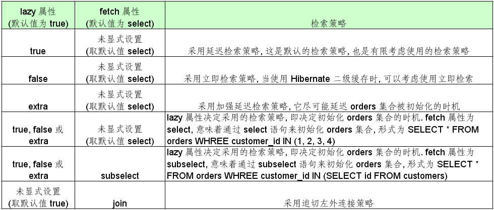

##### 9.3 详细见PPT或github代码

#### 10.检索方式

Hibernate 提供了以下几种检索对象的方式	参考4.4和4.5

* **导航对象图检索方式:**  根据已经加载的对象导航到其他对象
* **OID 检索方式:**  按照对象的 OID 来检索对象
* **HQL 检索方式**: 使用面向对象的 HQL 查询语言       类比JPQL、SQL
* **QBC 检索方式:** 使用 QBC(Query By Criteria) API 来检索对象. 这种 API 封装了基于字符串形式的查询语句, 提供了更加面向对象的查询接口. 
* **本地 SQL 检索方式**: 使用本地数据库的 SQL 查询语句

#### 11.缓存

默认一级缓存session管理，二级缓存sessionFacotry管理	类比mybatis、jpa缓存

缓存的事务

二级缓存使用方法：配置cfg文件、ecache文件

#### 12.其他扩展

* 批量处理数据是指在一个事务中处理大量数据.在应用层进行批量操作, 主要有以下方式:<br/>

1. 通过 Session 
2. 通过 HQL 
3. 通过 StatelessSession
4.  通过 JDBC API

* query的迭代器

  ~~~
  Query 接口的 iterator() 方法
  同 list() 一样也能执行查询操作
  list() 方法执行的 SQL 语句包含实体类对应的数据表的所有字段
  Iterator() 方法执行的SQL 语句中仅包含实体类对应的数据表的 ID 字段
  当遍历访问结果集时, 该方法先到 Session 缓存及二级缓存中查看是否存在特定 OID 的对象, 如果存在, 就直接返回该对象, 如果不存在该对象就通过相应的 SQL Select 语句到数据库中加载特定的实体对象
  大多数情况下, 应考虑使用 list() 方法执行查询操作. iterator() 方法仅在满足以下条件的场合, 可以稍微提高查询性能:
  要查询的数据表中包含大量字段
  启用了二级缓存, 且二级缓存中可能已经包含了待查询的对象
  ~~~

* 管理session

  ~~~
  Hibernate  自身提供了三种管理 Session 对象的方法
  Session 对象的生命周期与本地线程绑定
  Session 对象的生命周期与 JTA 事务绑定
  Hibernate 委托程序管理 Session 对象的生命周期
  在 Hibernate 的配置文件中, hibernate.current_session_context_class 属性用于指定 Session 管理方式, 可选值包括
  thread: Session 对象的生命周期与本地线程绑定
  jta*: Session 对象的生命周期与 JTA 事务绑定
  managed: Hibernate 委托程序来管理 Session 对象的生命周期

  ~~~

  ~~~xml
  	<!-- 配置管理 Session 的方式 -->
      <property name="current_session_context_class">thread</property>
  ~~~

  ​

### 注：

各种详细配置、api的实战、缓存等部分未作详细介绍，详见demo/实战

#TODO

本篇未介绍乐观锁

[乐观锁介绍](https://www.cnblogs.com/raphael5200/p/5114750.html)